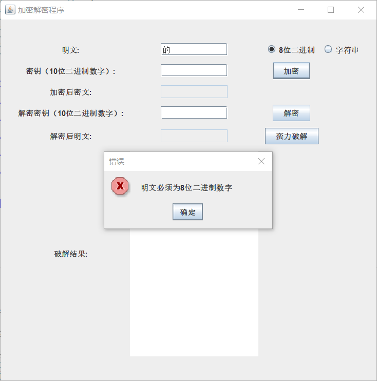
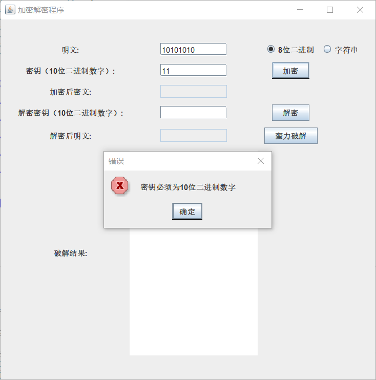
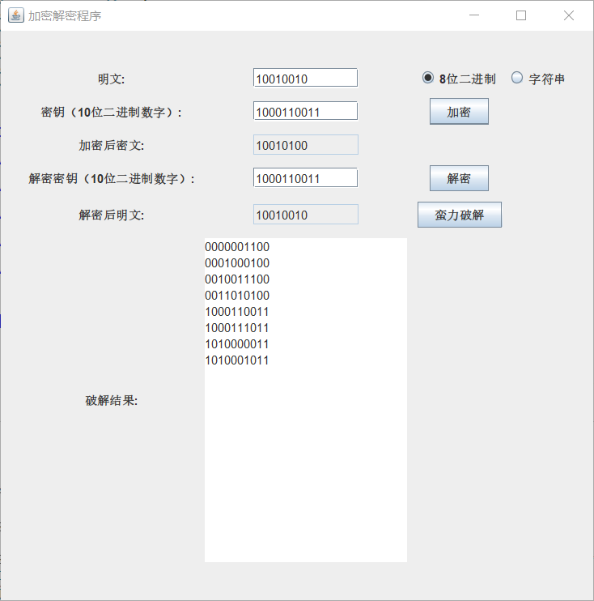
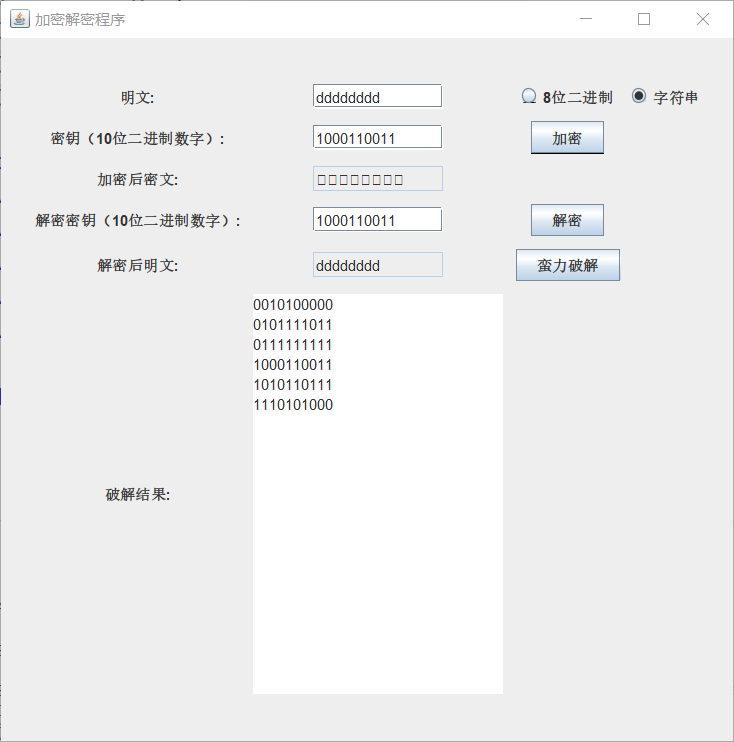
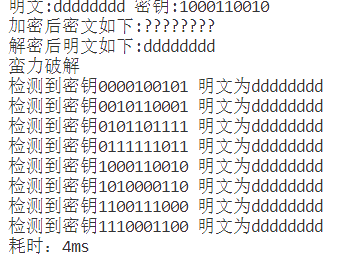
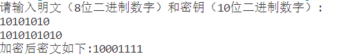
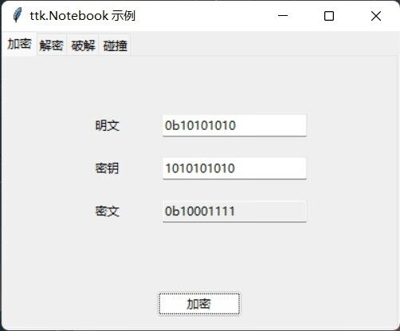

# Simple-DES-开发手册
一、项目简介
------

本项目实现了一个简单的加密和解密程序，并包括了蛮力破解的功能。程序采用Java语言编写，主要包括以下类和方法：

* `Cipher`类和`Decipher`类：包含了`cipher`和`Decipher`两个方法，分别用于对二进制明文进行加密和对密文进行解密。
* `ASCII`类：包含了`asciiEncipher`和`asciiDecipher`两个方法，分别用于对字符串明文进行加密和对密文进行解密。
* `Brute_force`类：包含了`brute_force`方法，用于对密文进行蛮力破解。
* `IP`类：包含了`IP_0`和`IP_1`两个方法，分别用于进行初始置换和最终置换。
* `F_round`类：包含了`EPBox`、`XOR`、`SBox1`、`SBox2`、`SPBox`等多个方法，用于进行扩展置换、异或运算、S盒替换和P盒置换等操作。
* `K_extend`类：包含了`P10`和`P8`两个方法，用于进行密钥的扩展和压缩。
* `Leftshift1`和`Leftshift2`类：包含了`Leftshift1`和`Leftshift2`两个方法，用于进行循环左移操作。
* `test_speed`类：包含了`main`方法，用于测试破解速度。

二、使用方法
------

1. 运行`EncipherUI.java`用于实现加解密和破解。

2. 处理用户输入：在用户界面上，用户可以输入明文和密钥，并选择输入数据类型，支持八位二进制数字和字符输入。输入类型错误会报错

   明文错误：

   

   密钥输入错误：

   

3. 加密明文：输入完密钥和明文后，点击加密将进行加密操作。

4. 解密密文：加密完成后，点击解密将进行解密操作。

5. 蛮力破解：点击蛮力破解，将破解密钥，并将所有可用的Key显示出来。

   效果如下：

   二进制数：

  

   字符：

   

6. 运行`test_speed.java`以测试破解速度。

   test_speed测试效果：

   
   

7.为保证程序无误，我们进行了组件测试，与其他Simple_DES小组一起进行了组件测试。

测试效果：
   本组加密：
   
   
   
   其他小组加密：
   
   

三、注意事项
------

1. 本程序只是一个简单的演示程序，仅供学习和交流使用，实际安全性较低。在实际应用中，应该采用更加复杂的加密算法和安全措施。
2. 在使用蛮力破解时，由于可能的密钥数量非常大，程序可能需要较长时间才能运行完毕。建议仅在必要时使用此功能，或者在保证安全性的前提下采用其他更加高效的破解方法。
3. 本程序的代码结构可能不够优化和合理，仅供参考和学习。在实际项目中，需要根据实际需求进行更合理的设计和实现。例如，可以将加密算法和安全措施进行模块化设计，提高代码的可读性和可维护性。
